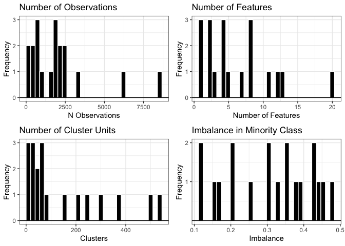
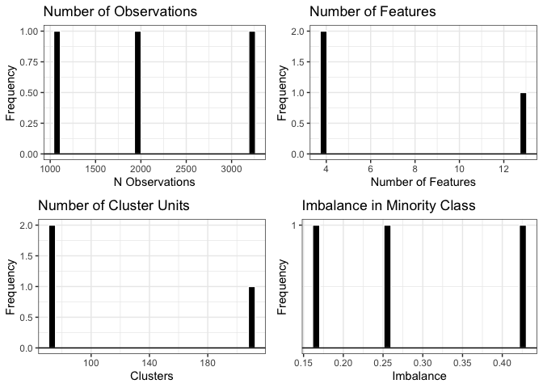

OpenClustered
================

OpenClustered is an R package data repository for clustered and
longitudinal datasets. The goal of this package is to coalesce clustered
datasets in harmonized fashioned for developing, testing, and
benchmarking existing and new methods for clustered data analysis and
prediction. Currently, there are 19 datasets in this repository loaded
in with the list “data_list”. Each dataset has a unique set of predictor
variables/features, with the outcome commonly renamed to “target” and
the cluster variable to “cluster_id”. The dataset “meta_data” contains
information on each of these data sets. Current functionality of this
package is basic - limited to reading in, summarizing, and subsetting
datasets based on user defined filtering criteria. The development of
this R package is ongoing, as we will continue to add more clustered
data sets they become available and can be harmonized. We will continue
to add more functionality to this package based on user
feedback/requests.

**If you have a clustered dataset without protected information that you
can make publicly available, please reach out and we would be happy to
incorporate it into this package**

Here is a simple tutorial for using this package:

## Install package from github

``` r
# Install package from github
devtools::install_github("https://github.com/NateOConnellPhD/OpenClustered")

# load package
library(OpenClustered)
```

Currently, the package has the following packages as dependecies:
tidyverse, gridExtra, and table1.

## View Meta Data and Info of available datasets

We can view info and meta data on the availble datasets within the list
‘data_list’ by viewing ‘meta_data’:

``` r
# View Meta Data files
# exclude the 6th column 'origin' for cleaner output
head(OpenClustered::meta_data)[,-6]
```

    ##   dataset dataset_name   outcome      domain sim_or_real n_obs n_features
    ## 1    dat1     hospital remission    medicine   simulated  8469         20
    ## 2   dat10     prenatal      care    medicine        real  2449         12
    ## 3   dat11       memory       acc   education        real  1602          5
    ## 4   dat12       dative      Verb linguistics        real  3263         13
    ## 5   dat13      culcita predation       ocean        real    80          1
    ## 6   dat14      toenail   outcome    medicine        real  1908          2
    ##   n_clusters n_classes imbalance           task missing_obs
    ## 1        381         2      0.30 Classification        8469
    ## 2        161         2      0.45 Classification        2449
    ## 3         34         2      0.31 Classification         462
    ## 4         75         2      0.26 Classification        2360
    ## 5         10         2      0.38 Classification          80
    ## 6        294         2      0.21 Classification        1908

### Plot Meta Data

We can further visually assess characteristics of the datasets with the
‘plot_meta_data()’ function. This function by default returns
characteristic plots for *all* included datasets in ‘data_list’. The
parameter ‘allplots’ is logical; if T, it returns a 2x2 grid of plots
characterizing the number of observations, features, clustering units,
and imbalance across datasets. If ‘allplots=F’, it returns a list with 4
elements containing each of these plots.

``` r
# View meta data characteristics of all datasets in `data_list`
plot_meta_data(allplots=T)
```

<!-- -->

### Tabulate Meta Data

We can further tabulate meta data summary statistics via the function
‘tab_meta_data’. At it’s core, this function is simply a wrapper for the
‘table1::table1” function, but further allows for simple specification
of a subset of datasets from data_list for summarization (to be shown in
an upcoming section). By defualt, this function summarizes all datasets
from “data_list”, with the primary parameter ’formula’ being a formula
specification following the notation, ’~ x + y + z\`, where x, y, and z
are variables to summarize.

``` r
# Summarize Meta Data (using r package "table1")
tab_meta_data(formula = ~n_obs + n_features + n_clusters + imbalance + missing_obs + 
                domain + sim_or_real)
```

<div class="Rtable1"><table class="Rtable1">
<thead>
<tr>
<th class='rowlabel firstrow lastrow'></th>
<th class='firstrow lastrow'><span class='stratlabel'>Overall<br><span class='stratn'>(N=19)</span></span></th>
</tr>
</thead>
<tbody>
<tr>
<td class='rowlabel firstrow'>n_obs</td>
<td class='firstrow'></td>
</tr>
<tr>
<td class='rowlabel'>Mean (SD)</td>
<td>2060 (2110)</td>
</tr>
<tr>
<td class='rowlabel lastrow'>Median [Min, Max]</td>
<td class='lastrow'>1910 [80.0, 8470]</td>
</tr>
<tr>
<td class='rowlabel firstrow'>n_features</td>
<td class='firstrow'></td>
</tr>
<tr>
<td class='rowlabel'>Mean (SD)</td>
<td>6.11 (5.08)</td>
</tr>
<tr>
<td class='rowlabel lastrow'>Median [Min, Max]</td>
<td class='lastrow'>4.00 [1.00, 20.0]</td>
</tr>
<tr>
<td class='rowlabel firstrow'>n_clusters</td>
<td class='firstrow'></td>
</tr>
<tr>
<td class='rowlabel'>Mean (SD)</td>
<td>149 (168)</td>
</tr>
<tr>
<td class='rowlabel lastrow'>Median [Min, Max]</td>
<td class='lastrow'>60.0 [10.0, 537]</td>
</tr>
<tr>
<td class='rowlabel firstrow'>imbalance</td>
<td class='firstrow'></td>
</tr>
<tr>
<td class='rowlabel'>Mean (SD)</td>
<td>0.309 (0.118)</td>
</tr>
<tr>
<td class='rowlabel lastrow'>Median [Min, Max]</td>
<td class='lastrow'>0.330 [0.120, 0.480]</td>
</tr>
<tr>
<td class='rowlabel firstrow'>missing_obs</td>
<td class='firstrow'></td>
</tr>
<tr>
<td class='rowlabel'>Mean (SD)</td>
<td>1940 (2130)</td>
</tr>
<tr>
<td class='rowlabel lastrow'>Median [Min, Max]</td>
<td class='lastrow'>1910 [80.0, 8470]</td>
</tr>
<tr>
<td class='rowlabel firstrow'>domain</td>
<td class='firstrow'></td>
</tr>
<tr>
<td class='rowlabel'>animal</td>
<td>2 (10.5%)</td>
</tr>
<tr>
<td class='rowlabel'>education</td>
<td>1 (5.3%)</td>
</tr>
<tr>
<td class='rowlabel'>linguistics</td>
<td>6 (31.6%)</td>
</tr>
<tr>
<td class='rowlabel'>medicine</td>
<td>6 (31.6%)</td>
</tr>
<tr>
<td class='rowlabel'>ocean</td>
<td>1 (5.3%)</td>
</tr>
<tr>
<td class='rowlabel'>politics</td>
<td>1 (5.3%)</td>
</tr>
<tr>
<td class='rowlabel lastrow'>Missing</td>
<td class='lastrow'>2 (10.5%)</td>
</tr>
<tr>
<td class='rowlabel firstrow'>sim_or_real</td>
<td class='firstrow'></td>
</tr>
<tr>
<td class='rowlabel'>real</td>
<td>16 (84.2%)</td>
</tr>
<tr>
<td class='rowlabel lastrow'>simulated</td>
<td class='lastrow'>3 (15.8%)</td>
</tr>
</tbody>
</table>
</div>

## Subsetting data_list

We provide wrapper functons for easily subsetting the ‘data_list’ based
on meta data criteria through the function ‘filter_data()’. The primary
inputs follow ‘dplyr::filter()’ syntax. The ‘subset’ parameter is
logical. If “TRUE”, it returns a list containing each dataset meeting
the specified criteria as an element of that list. If “FALSE”, the
function returns a vector of the dataset names matching the filtered
criteria.

Here’s an example of us subsetting our ‘data_list’ to only those with
\>= 1000 observations within the domain “linguistics”:

``` r
# Subset data_list to datasets with >5000 observations and in the domain of 'linguistics'
ling_data = filter_data(n_obs >=1000, domain=="linguistics", subset=T)
```

### Summary Plots of Linguistics data

We can then plot the meta data characteristics as we did before, but
specifically for this subset data using the “plot_meta_data()” function
and specifying the ‘df’ parameter to be the new subset list. Note, the
‘df’ parameter in ‘plot_meta_data()’ can be either a list or the vector
of dataset names given by ‘filter_data()’:

``` r
# view characteristics of new data
plot_meta_data(allplots=T, df = ling_data)
```

<!-- -->

### Tabulate Sumamry Statistics for Linguistics Data

Similarly, we can tabulate these chacarteristics in the
“tab_meta_data()” functuon through the ‘df’ parameter in the same way:

``` r
# Summarize the list of linguistic datasets with >=1000 observations
tab_meta_data(~n_obs + n_features + n_clusters + imbalance + missing_obs + 
                domain + sim_or_real, df= ling_data)
```

<div class="Rtable1"><table class="Rtable1">
<thead>
<tr>
<th class='rowlabel firstrow lastrow'></th>
<th class='firstrow lastrow'><span class='stratlabel'>Overall<br><span class='stratn'>(N=3)</span></span></th>
</tr>
</thead>
<tbody>
<tr>
<td class='rowlabel firstrow'>n_obs</td>
<td class='firstrow'></td>
</tr>
<tr>
<td class='rowlabel'>Mean (SD)</td>
<td>2130 (1080)</td>
</tr>
<tr>
<td class='rowlabel lastrow'>Median [Min, Max]</td>
<td class='lastrow'>2000 [1110, 3260]</td>
</tr>
<tr>
<td class='rowlabel firstrow'>n_features</td>
<td class='firstrow'></td>
</tr>
<tr>
<td class='rowlabel'>Mean (SD)</td>
<td>7.00 (5.20)</td>
</tr>
<tr>
<td class='rowlabel lastrow'>Median [Min, Max]</td>
<td class='lastrow'>4.00 [4.00, 13.0]</td>
</tr>
<tr>
<td class='rowlabel firstrow'>n_clusters</td>
<td class='firstrow'></td>
</tr>
<tr>
<td class='rowlabel'>Mean (SD)</td>
<td>118 (78.0)</td>
</tr>
<tr>
<td class='rowlabel lastrow'>Median [Min, Max]</td>
<td class='lastrow'>75.0 [71.0, 208]</td>
</tr>
<tr>
<td class='rowlabel firstrow'>imbalance</td>
<td class='firstrow'></td>
</tr>
<tr>
<td class='rowlabel'>Mean (SD)</td>
<td>0.287 (0.132)</td>
</tr>
<tr>
<td class='rowlabel lastrow'>Median [Min, Max]</td>
<td class='lastrow'>0.260 [0.170, 0.430]</td>
</tr>
<tr>
<td class='rowlabel firstrow'>missing_obs</td>
<td class='firstrow'></td>
</tr>
<tr>
<td class='rowlabel'>Mean (SD)</td>
<td>1820 (642)</td>
</tr>
<tr>
<td class='rowlabel lastrow'>Median [Min, Max]</td>
<td class='lastrow'>2000 [1110, 2360]</td>
</tr>
<tr>
<td class='rowlabel firstrow'>domain</td>
<td class='firstrow'></td>
</tr>
<tr>
<td class='rowlabel lastrow'>linguistics</td>
<td class='lastrow'>3 (100%)</td>
</tr>
<tr>
<td class='rowlabel firstrow'>sim_or_real</td>
<td class='firstrow'></td>
</tr>
<tr>
<td class='rowlabel lastrow'>real</td>
<td class='lastrow'>3 (100%)</td>
</tr>
</tbody>
</table>
</div>

# Example

In this example, we will take one of the linguistics datasets above
(“dat12” which can be called through the subset data list
“ling_dat\$dat12”) and create a assess AUC performance of a predicton
model using training and testing data and a GLMM with the package
‘lme4’. Note, we exclude one variable ‘Speaker’ due to sparsity

``` r
### Develop a Logistic Prediction Model on one of the datasets (dat12) in Linguistics 
### Load in necessary packages
library(lme4)
library(pROC)

#Summarize ling_dat$dat12 using table1 package
# Summarize dat12 using Table 1
table1::table1(~Modality + SemanticClass + LengthOfRecipient + 
                 AnimacyOfRec+ + DefinOfRec + PronomOfRec+LengthOfTheme+ AnimacyOfTheme+
                 DefinOfTheme+PronomOfTheme+AccessOfRec+AccessOfTheme, data=ling_data$dat12)
```

<div class="Rtable1"><table class="Rtable1">
<thead>
<tr>
<th class='rowlabel firstrow lastrow'></th>
<th class='firstrow lastrow'><span class='stratlabel'>Overall<br><span class='stratn'>(N=3263)</span></span></th>
</tr>
</thead>
<tbody>
<tr>
<td class='rowlabel firstrow'>Modality</td>
<td class='firstrow'></td>
</tr>
<tr>
<td class='rowlabel'>spoken</td>
<td>2360 (72.3%)</td>
</tr>
<tr>
<td class='rowlabel lastrow'>written</td>
<td class='lastrow'>903 (27.7%)</td>
</tr>
<tr>
<td class='rowlabel firstrow'>SemanticClass</td>
<td class='firstrow'></td>
</tr>
<tr>
<td class='rowlabel'>a</td>
<td>1433 (43.9%)</td>
</tr>
<tr>
<td class='rowlabel'>c</td>
<td>405 (12.4%)</td>
</tr>
<tr>
<td class='rowlabel'>f</td>
<td>59 (1.8%)</td>
</tr>
<tr>
<td class='rowlabel'>p</td>
<td>228 (7.0%)</td>
</tr>
<tr>
<td class='rowlabel lastrow'>t</td>
<td class='lastrow'>1138 (34.9%)</td>
</tr>
<tr>
<td class='rowlabel firstrow'>LengthOfRecipient</td>
<td class='firstrow'></td>
</tr>
<tr>
<td class='rowlabel'>Mean (SD)</td>
<td>1.84 (2.07)</td>
</tr>
<tr>
<td class='rowlabel lastrow'>Median [Min, Max]</td>
<td class='lastrow'>1.00 [1.00, 31.0]</td>
</tr>
<tr>
<td class='rowlabel firstrow'>AnimacyOfRec</td>
<td class='firstrow'></td>
</tr>
<tr>
<td class='rowlabel'>animate</td>
<td>3024 (92.7%)</td>
</tr>
<tr>
<td class='rowlabel lastrow'>inanimate</td>
<td class='lastrow'>239 (7.3%)</td>
</tr>
<tr>
<td class='rowlabel firstrow'>DefinOfRec</td>
<td class='firstrow'></td>
</tr>
<tr>
<td class='rowlabel'>definite</td>
<td>2775 (85.0%)</td>
</tr>
<tr>
<td class='rowlabel lastrow'>indefinite</td>
<td class='lastrow'>488 (15.0%)</td>
</tr>
<tr>
<td class='rowlabel firstrow'>PronomOfRec</td>
<td class='firstrow'></td>
</tr>
<tr>
<td class='rowlabel'>nonpronominal</td>
<td>1229 (37.7%)</td>
</tr>
<tr>
<td class='rowlabel lastrow'>pronominal</td>
<td class='lastrow'>2034 (62.3%)</td>
</tr>
<tr>
<td class='rowlabel firstrow'>LengthOfTheme</td>
<td class='firstrow'></td>
</tr>
<tr>
<td class='rowlabel'>Mean (SD)</td>
<td>4.27 (4.36)</td>
</tr>
<tr>
<td class='rowlabel lastrow'>Median [Min, Max]</td>
<td class='lastrow'>3.00 [1.00, 46.0]</td>
</tr>
<tr>
<td class='rowlabel firstrow'>AnimacyOfTheme</td>
<td class='firstrow'></td>
</tr>
<tr>
<td class='rowlabel'>animate</td>
<td>74 (2.3%)</td>
</tr>
<tr>
<td class='rowlabel lastrow'>inanimate</td>
<td class='lastrow'>3189 (97.7%)</td>
</tr>
<tr>
<td class='rowlabel firstrow'>DefinOfTheme</td>
<td class='firstrow'></td>
</tr>
<tr>
<td class='rowlabel'>definite</td>
<td>929 (28.5%)</td>
</tr>
<tr>
<td class='rowlabel lastrow'>indefinite</td>
<td class='lastrow'>2334 (71.5%)</td>
</tr>
<tr>
<td class='rowlabel firstrow'>PronomOfTheme</td>
<td class='firstrow'></td>
</tr>
<tr>
<td class='rowlabel'>nonpronominal</td>
<td>2842 (87.1%)</td>
</tr>
<tr>
<td class='rowlabel lastrow'>pronominal</td>
<td class='lastrow'>421 (12.9%)</td>
</tr>
<tr>
<td class='rowlabel firstrow'>AccessOfRec</td>
<td class='firstrow'></td>
</tr>
<tr>
<td class='rowlabel'>accessible</td>
<td>615 (18.8%)</td>
</tr>
<tr>
<td class='rowlabel'>given</td>
<td>2302 (70.5%)</td>
</tr>
<tr>
<td class='rowlabel lastrow'>new</td>
<td class='lastrow'>346 (10.6%)</td>
</tr>
<tr>
<td class='rowlabel firstrow'>AccessOfTheme</td>
<td class='firstrow'></td>
</tr>
<tr>
<td class='rowlabel'>accessible</td>
<td>1742 (53.4%)</td>
</tr>
<tr>
<td class='rowlabel'>given</td>
<td>502 (15.4%)</td>
</tr>
<tr>
<td class='rowlabel lastrow'>new</td>
<td class='lastrow'>1019 (31.2%)</td>
</tr>
</tbody>
</table>
</div>

We then split the dataset into training and testing datasets with a
70:30 split:

``` r
set.seed(123)

# Split Dataset by single split into training and testing datasets
train_ids <- sample(1:nrow(ling_data$dat12), size = round(.7 * nrow(ling_data$dat12)))
train_data <- ling_data$dat12[train_ids, ]  # Training set
test_data <- ling_data$dat12[-train_ids, ]  # Testing set
```

We then fit our mixed model:

``` r
#Fit Mixed Model
fit = glmer(target == "PP" ~ Modality + SemanticClass + LengthOfRecipient + 
             AnimacyOfRec+ + DefinOfRec + PronomOfRec+LengthOfTheme+ AnimacyOfTheme+
             DefinOfTheme+PronomOfTheme+AccessOfRec+AccessOfTheme+(1|cluster_id), data=train_data,
            family=binomial(link="logit"))
```

    ## Warning in checkConv(attr(opt, "derivs"), opt$par, ctrl = control$checkConv, :
    ## Model failed to converge with max|grad| = 0.0226843 (tol = 0.002, component 1)

``` r
# Summarize Mixed Model
summary(fit)
```

    ## Generalized linear mixed model fit by maximum likelihood (Laplace
    ##   Approximation) [glmerMod]
    ##  Family: binomial  ( logit )
    ## Formula: target == "PP" ~ Modality + SemanticClass + LengthOfRecipient +  
    ##     AnimacyOfRec + +DefinOfRec + PronomOfRec + LengthOfTheme +  
    ##     AnimacyOfTheme + DefinOfTheme + PronomOfTheme + AccessOfRec +  
    ##     AccessOfTheme + (1 | cluster_id)
    ##    Data: train_data
    ## 
    ##      AIC      BIC   logLik deviance df.resid 
    ##   1116.0   1224.9   -539.0   1078.0     2265 
    ## 
    ## Scaled residuals: 
    ##     Min      1Q  Median      3Q     Max 
    ## -5.0085 -0.2041 -0.0866  0.0220 14.1470 
    ## 
    ## Random effects:
    ##  Groups     Name        Variance Std.Dev.
    ##  cluster_id (Intercept) 3.503    1.872   
    ## Number of obs: 2284, groups:  cluster_id, 64
    ## 
    ## Fixed effects:
    ##                         Estimate Std. Error z value Pr(>|z|)    
    ## (Intercept)              2.25109    0.76820   2.930  0.00339 ** 
    ## Modalitywritten          0.07323    0.24396   0.300  0.76403    
    ## SemanticClassc           0.25905    0.40679   0.637  0.52425    
    ## SemanticClassf           0.02539    0.69753   0.036  0.97096    
    ## SemanticClassp          -3.83339    1.43815  -2.665  0.00769 ** 
    ## SemanticClasst           0.13517    0.25288   0.535  0.59296    
    ## LengthOfRecipient        0.29068    0.05350   5.433 5.54e-08 ***
    ## AnimacyOfRecinanimate    2.13401    0.30629   6.967 3.23e-12 ***
    ## DefinOfRecindefinite     0.78927    0.24259   3.253  0.00114 ** 
    ## PronomOfRecpronominal   -1.91310    0.27080  -7.065 1.61e-12 ***
    ## LengthOfTheme           -0.22282    0.03122  -7.138 9.47e-13 ***
    ## AnimacyOfThemeinanimate -1.37084    0.59341  -2.310  0.02088 *  
    ## DefinOfThemeindefinite  -1.02552    0.22581  -4.541 5.59e-06 ***
    ## PronomOfThemepronominal  2.19914    0.30204   7.281 3.31e-13 ***
    ## AccessOfRecgiven        -1.01182    0.25989  -3.893 9.89e-05 ***
    ## AccessOfRecnew           0.51658    0.28871   1.789  0.07357 .  
    ## AccessOfThemegiven       1.49852    0.31372   4.777 1.78e-06 ***
    ## AccessOfThemenew        -0.32767    0.22954  -1.428  0.15343    
    ## ---
    ## Signif. codes:  0 '***' 0.001 '**' 0.01 '*' 0.05 '.' 0.1 ' ' 1

    ## 
    ## Correlation matrix not shown by default, as p = 18 > 12.
    ## Use print(x, correlation=TRUE)  or
    ##     vcov(x)        if you need it

    ## optimizer (Nelder_Mead) convergence code: 0 (OK)
    ## Model failed to converge with max|grad| = 0.0226843 (tol = 0.002, component 1)

And lastly we predict over the test dataset and assess the AUC using the
\`pROC’ package:

``` r
# Predict 
test_data$predicted_prob <- test_data$predicted_prob <- predict(fit, newdata = test_data, type = "response",
                                    allow.new.levels=T)

# Compute AUC
auc_result <- pROC::roc(response =test_data$target, predictor = test_data$predicted_prob)
```

Which returns:

``` r
auc_result
```

    ## 
    ## Call:
    ## roc.default(response = test_data$target, predictor = test_data$predicted_prob)
    ## 
    ## Data: test_data$predicted_prob in 739 controls (test_data$target NP) < 240 cases (test_data$target PP).
    ## Area under the curve: 0.9674
